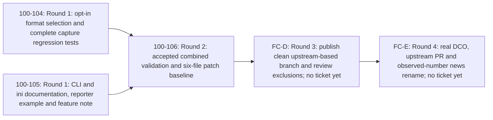

# Full-fidelity Memray captures: fan-out plan

## Delivery revision R2 — 100-107

Proposed for review after Jeremy accepted [PR #7](https://github.com/jeremycarroll/pytest-memray/pull/7)
at head `9d66e4975ef3406b67db46fba9048e3ded186a62`, merged to main as
`4b47fd033ac826a9bb28ba8c64cd8d9de7bd1029` on 2026-09-12. His
[review 5187653118](https://github.com/jeremycarroll/pytest-memray/pull/7#pullrequestreview-5187653118)
requires a clean contribution branch, reviewable preparation/removal and a later
upstream PR. His repository admin authority was reverified. This supersedes the
patch-only project endpoint, without reopening accepted product work.

The [original accepted plan at d403161](https://github.com/jeremycarroll/pytest-memray/blob/d403161792521f57d9a633c09b99c9d07fd5c1a2/docs/symphony-plans/fan-out-plan-100-102-full-captures.md)
and [merged delivery record](https://github.com/jeremycarroll/pytest-memray/blob/4b47fd033ac826a9bb28ba8c64cd8d9de7bd1029/docs/symphony-plans/full-captures-delivery.md)
remain historical evidence. This revision changes delivery ownership only.
[100-107](https://linear.app/1000lines/issue/100-107) creates no implementation
tickets or delivery branch. After its acceptance/merge,
[100-108](https://linear.app/1000lines/issue/100-108) applies R2 and creates only
FC-D and FC-E. Existing FC-A/100-104, FC-B/100-105 and FC-C/100-106 remain Done;
100-101 through 100-105 retain their identities and accepted work.

| Item               | Outcome and owned files                                                                                 | Estimated additions / deletions                                  | Difficulty |
| ------------------ | ------------------------------------------------------------------------------------------------------- | ---------------------------------------------------------------- | ---------- |
| FC-A / 100-104     | Accepted configuration, Tracker selection and regression/reporter tests; plugin.py and two test modules | Historical 300–550 / 15–45                                       | hard       |
| FC-B / 100-105     | Accepted user instructions and provisional feature note; README/configuration/news                      | Historical 80–140 / 0–10                                         | easy       |
| FC-C / 100-106     | Accepted combined validation, cleanup audit and reproducible patch baseline                             | Historical 100–200 / 0–30, record only                           | hard       |
| FC-D / not created | Publish and review the clean branch; one main-based preparation record                                  | 180–280 / 0–20 in task PR; separate artifact 560 / 39            | hard       |
| FC-E / not created | Certify, submit upstream and rename observed-number fragment; one submission record plus exact rename   | 120–220 / 0–10 in task PR; artifact metadata rewrite plus rename | hard       |

Five meaningful implementation nodes, four hard edges, **four total dependency
rounds; two remaining delivery rounds**. Planning/fan-out seed chain
`100-106 → 100-107 → 100-108` gates commissioning separately and is not recreated
as implementation payloads. Estimates are review-size guidance, not quotas.

## Metadata and baseline

- `project_code`: full-captures; `project_color`: orange.
- `repository`: jeremycarroll/pytest-memray; `base_branch`: main.
- `seed_issue`: 100-107 (revision of 100-102); `target_project`: Full-fidelity Memray captures
  (`13af5f34-7e77-4b32-863f-97ded4ea9b16`); Linear team 100
  (`2d7d1d7e-47ff-45d2-8097-19307ad5a589`).
- `human_lead`: Jeremy Carroll, Linear `c65b9fbe-e740-47e9-b444-3172d3526ff2`,
  GitHub `jeremycarroll`. Assign each new issue and fork PR to this lead.
- `linear_issue_labels`: [orange]; `github_pr_labels`: [orange, symphony].
  Difficulty is a field, not an additional label. Do not initially set mature.
- `baseline_context`: main at `4b47fd033ac826a9bb28ba8c64cd8d9de7bd1029`,
  read 2026-09-12. Product design PR #2 and plan PR #3 remain accepted.
- Reuse 100-108 for this fan-out. Bind existing node UUIDs below; never regenerate
  their issue bodies or reopen Done work. Read back the project issue set before
  creating FC-D/FC-E, reusing any confirmed IDs from an earlier attempt.
- `known_open_decisions`: none. Preserve design R1–R7 and D1–D8. Runtime versions,
  emitted paths, future PR numbers, App/check IDs and signoff permission are
  owned execution inputs, not reasons to defer independent work.

## Decomposition judgment

1. A single implementation/docs/delivery ticket would reduce coordination but
   mix configuration correctness with external submission and make the final
   combined audit less visible.
2. Separate configuration, Tracker, capture tests, docs and delivery tickets
   would repeatedly edit plugin.py and the same pytester module, creating extra
   dependency rounds without independent product outcomes.
3. **Choose implementation/tests and documentation in parallel, then delivery.**
   The accepted design supplies the docs contract now. FC-A and FC-B have
   disjoint file writes, isolated workspaces/test outputs, separate branches and
   PRs, and no shared database, account reset or publish destination. Both read
   upstream sources and existing label definitions without changing them.
   FC-B coordinates merge readiness with FC-A's reporter evidence as soft
   sequencing; it can be authored, built and reviewed without unmerged code.
   FC-C needs both accepted results on main to audit the combined deliverable
   and take over correction rights, so its two incoming edges are hard.

For this revision, combining preparation and submission would tie review of a
reproducible clean artifact to missing human certification. Splitting inventory,
construction and removal into separate tasks would add repeated ownership of the
same branch without a separate useful outcome. **Choose one preparation/review
node FC-D, then one submission/fragment node FC-E.** Both mutate the same external
branch sequentially; FC-E also needs the actual PR number before the rename.
Direct construction from upstream plus the six-file patch omits both working
files and unrelated commits. Copying fork main then deleting files would retain
22 fork-only commits at this snapshot, including onboarding and plan history.
It would also require reviewing deletions that direct construction makes
unnecessary. The main-based FC-D record PR reviews the exclusions, exact artifact
commit/tree and comparison; it does not delete evidence from main or target the
artifact branch. The artifact remains separately inspectable by Jeremy.

The diagram shows hard implementation dependencies only. Rounds count nodes
along the longest path, not elapsed time or worker capacity. A/B's historic
parallel boundary remains intact; no new product implementation is commissioned.

## DAG



The standalone graph is
[fan-out-plan-100-102-full-captures.mmd](./fan-out-plan-100-102-full-captures.mmd).
FC-C retains its two independent accepted inputs. FC-D requires its actual
patch/evidence on main; FC-E requires the accepted published artifact and its
main-based review record. There are no redundant transitive implementation edges.

Fan-out: [verified issue and branch mapping](./fan-out-100-103-mapping.md).

## Execution, source and validation contract

The [execution contract](./full-captures-execution-contract.md) is part of this
reviewed plan. It contains the shared ticket instructions, exact validation
environment and 12 mandatory CI checks, fan-out preflight, source-read ledger
and shared-renderer limitation. Copy its shared execution and validation
sections inline into every generated ticket alongside the manifest node.
All references below to Validation environment mean that document's section.

## Manifest and task content

FC-A/FC-B/FC-C retain their commissioning keys and bind to existing Done issues.
Only FC-D and FC-E are new commissioning keys, **not live Linear identifiers**.
The node fields below are project-specific ticket content in the existing plan
format, not additions to the shared schema. The unchanged shared parser validates
the core graph/manifest contract; the execution contract records rendering limits.

```yaml
schema: symphony-dag-manifest/v1
project:
  code: full-captures
  color: orange
  base_branch: main
  human_lead: Jeremy Carroll
  human_lead_github: jeremycarroll
  linear_issue_labels: [orange]
  github_pr_labels: [orange, symphony]
defaults:
  initial_state: Active
  maturity_label: mature
  task_branch_base: main
  task_pr_base: main
  task_pr_draft: true
  issue_assignee: Jeremy Carroll
  pr_assignee: jeremycarroll
  edge_semantics: hard blockers; predecessor accepted, Done and task PR merged to main
  relation_type: blocks
  mutation_policy: fail closed; Backlog staging, verified relations, then Active
nodes:
  - id: FC_A
    payload_key: FC-A
    existing_issue: 100-104
    issue_id: 8529b5a2-af58-41d7-b1c3-0995a14160bf
    title: Add full capture selection with configuration and reporter regression coverage
    type: task
    difficulty: hard
    labels: [orange]
    branch:
      template: symphony/full-captures/${issue}/full-capture-selection
      base: main
      birth: on_dispatch
    pr:
      create: when_independent_work_publishable
      base: main
      draft: true
      labels: [orange, symphony]
    summary: >-
      Let users choose full allocation captures through --memray-full or
      memray_full while preserving aggregated captures by default. Keep all
      tracking and tracing behavior intact and prove the persisted binaries
      work with the stats reporter, using the existing pytester suite.
    scope: Configuration registration/resolution, existing Tracker argument, AC1-AC6 tests and compatibility/reporter evidence.
    creates: []
    edits:
      - src/pytest_memray/plugin.py
      - tests/test_pytest_memray.py
      - tests/test_object_tracking.py
    owned_files:
      - src/pytest_memray/plugin.py
      - tests/test_pytest_memray.py
      - tests/test_object_tracking.py
    owned_external_resources:
      - FC-A task branch, fork PR and its check/review evidence in jeremycarroll/pytest-memray; no other task PR mutation.
      - FC-A workspace-local virtualenvs, pytester directories, capture files and Docker containers; create/read/delete only these fixtures.
    source_files:
      - docs/symphony-plans/full-captures-requirements-design.md
      - src/pytest_memray/plugin.py
      - src/pytest_memray/utils.py
      - tests/test_pytest_memray.py
      - tests/test_object_tracking.py
      - tests/conftest.py
      - pyproject.toml
      - tox.ini
      - Makefile
      - docker-compose.yml
      - .symphony.cfg.json
    source_notes: Read the project brief, issue 160 and comments, PR 107, release 1.6.0 and official stats docs from the source ledger; shared label definitions are read-only.
    dependencies: []
    integration_pattern:
      pattern: none
    required_actions:
      - Register --memray-full as store_true with absent CLI value None; register Boolean memray_full default false, including CLI help about storage/runtime cost.
      - Before Manager construction, explicitly validate memray_full with pytest's Boolean parser; convert invalid ini to UsageError even with CLI true or inactive tracking. Leave value_or_ini and unrelated option defaults unchanged.
      - Resolve format once per configuration and pass it at the existing tracker_kwargs construction; preserve activation, native/Python tracing overrides, sync/async, persistence and workers.
      - Cover every design configuration-table row in pytest.ini and pyproject.toml where applicable, including -o overrides, repetition, invalid ini and attached CLI values.
      - Extend existing Tracker wrapping assertions to both formats times native on/off times Python allocator tracing on/off; keep all eight combinations and existing default-mode coverage.
      - Extend real persisted-capture tests using fresh directories and subprocess pytest; validate filenames, prefix, parametrized cases, metadata, readability and post-exit survival in both modes.
      - Add a subprocess stats regression using a known allocating fixture; assert positive allocation output for full capture and semantic aggregated-input rejection without matching a whole traceback.
      - Exercise full mode with no activation, marker-only activation, summary/limit_memory, limit_leaks overrides, async, xdist propagation and object tracking on supported Python; retain retry/conflict/cleanup/long-name/overwrite coverage.
      - Verify minimum Memray 1.19.1 on a compatible interpreter and normal supported CI; record version resolution and exact reporter/capture commands and paths in PR/workpad evidence.
    acceptance_checks:
      - Design AC1 and AC2 configuration/invalid-input cases pass; invalid ini creates no Manager result directories or Tracker.
      - Design AC3 eight argument combinations and independent activation rules pass without changing unrelated settings.
      - Design AC4 binaries in both modes are real, closed, readable and retained with expected per-test metadata and names.
      - Design AC5 full-mode stats succeeds with positive allocations; aggregated stats rejects the same-version fixture as non-full input; exact commands, versions and SHA are recorded.
      - Design AC6 full-mode integration paths and existing regression suite pass, including applicable object tracking and all mandatory current-head checks.
      - Dependency bounds remain unchanged; any unresolved compatibility result is visible and prevents a false compatibility claim.
    validation_commands:
      - "python -m pytest -q tests/test_pytest_memray.py tests/test_object_tracking.py"
      - "make check"
      - "make lint"
      - "python -c 'import sys, pytest, memray; print(sys.version); print(pytest.__version__); print(memray.__version__)'"
      - "python -m pytest --memray --memray-full --memray-bin-path CAPTURE_DIR TEST_FILE"
      - "python -m memray stats CAPTURE.bin"
      - "Repeat the capture without --memray-full in a fresh directory; stats must reject the aggregated binary. Resolve fixture paths from actual emitted files."
      - "Run AC1-AC6 with memray==1.19.1 in an isolated compatible environment; retain version output and applicable interpreter limitations."
      - "Then Docker only for unavailable required local checks, using Validation environment; otherwise record Docker: skipped — passed locally."
      - "Then mandatory published-head Run and Build checks: all 12 named in Validation environment."
    delivery_notes:
      - Estimate 300-550 additions and 15-45 deletions; keep implementation and meaningful regression tests in one PR.
      - E1/E2 owner; E3/E5 for this PR. Give FC-B the exact successful reporter command/version without editing its files.
      - FC-C takes correction ownership only after this result is accepted and merged to main; do not overlap later rework without coordinating the plan.
    split_criteria:
      [domain-boundary, shared-orchestrator-file, validation-surface]
    exclusions:
      - README.md, docs/configuration.rst and news edits belong to FC-B.
      - No environment variable, negative flag, enum, alias, new capture pipeline or shared configuration-helper repair.
      - No changes to markers, output, file naming/cleanup, dependency floors, CI workflows or release/deploy operations.

  - id: FC_B
    payload_key: FC-B
    existing_issue: 100-105
    issue_id: cb829111-50a2-4d20-9622-7feece1a60ca
    title: Document full capture configuration and downstream reporter use
    type: task
    difficulty: easy
    labels: [orange]
    branch:
      template: symphony/full-captures/${issue}/full-capture-docs
      base: main
      birth: on_dispatch
    pr:
      create: when_independent_work_publishable
      base: main
      draft: true
      labels: [orange, symphony]
    summary: >-
      Explain how users opt into full captures for allocation-level reporting,
      retain capture files and return to the aggregated default. Document the
      accepted CLI/ini contract and cost without implying that full mode enables
      tracking or isolates a subsection of a test.
    scope: README and configuration guide updates plus a towncrier feature fragment; AC7.
    creates:
      - docs/news/160.feature.rst
    edits:
      - README.md
      - docs/configuration.rst
    owned_files:
      - README.md
      - docs/configuration.rst
      - docs/news/160.feature.rst
    owned_external_resources:
      - FC-B task branch, fork PR and its check/review evidence in jeremycarroll/pytest-memray; no other task PR mutation.
      - FC-B workspace-local docs output, virtualenv and Docker containers; no hosted documentation publication or shared capture directory.
    source_files:
      - docs/symphony-plans/full-captures-requirements-design.md
      - README.md
      - docs/configuration.rst
      - docs/news/template.jinja2
      - pyproject.toml
      - Makefile
      - tox.ini
      - docker-compose.yml
      - .symphony.cfg.json
    source_notes: Read issue 160 and comments, PR 107, release 1.6.0 and official reporter docs; use FC-A evidence when available, with the accepted design as the initial interface source.
    dependencies:
      - item: FC-A
        type: sequencing
        requires: Inspect FC-A's successful stats command/version before final documentation merge readiness.
        reason: Drafting, docs builds and review are independent; executing the new CLI example requires FC-A, and FC-C rechecks it on combined main.
    integration_pattern:
      pattern: none
    required_actions:
      - Document --memray-full and Boolean memray_full in both option references; default false/aggregated, CLI-over-ini and -o memray_full=false without the CLI flag.
      - Include pytest.ini and pyproject.toml examples, explicit --memray activation and --memray-bin-path persistence, including the native and Python allocator options from issue 160.
      - Explain invalid Boolean/attached-value errors, harmless repeated flags, independent tracking activation and unchanged temporary-file lifetime.
      - Give the stats workflow from the design and exact observed version from FC-A when available; discover the emitted .bin rather than select metadata. Clearly distinguish planned examples from executed evidence until verified.
      - Explain increased file size and potential runtime overhead without numbers; full format changes neither allocator coverage nor whole-test tracking boundaries, and manual Tracker remains appropriate for subtest isolation.
      - Add docs/news/160.feature.rst referencing the actual upstream issue, with no invented PR number; FC-C renames to the real upstream PR number when available.
    acceptance_checks:
      - Design AC7 is covered in README/configuration docs; both settings, precedence/disable override, persistence, cost and manual-Tracker boundary are clear.
      - Examples agree with the accepted design and FC-A's observed reporter interface before merge readiness; no unrun example is described as verified.
      - Markdown formatting, Sphinx docs and all 12 current-head required checks pass, even though only documentation changes.
      - Feature fragment exists and uses actual issue 160 as the provisional number; the final PR-number handoff to FC-C is explicit.
    validation_commands:
      - "prettier --no-editorconfig --check README.md"
      - "make docs"
      - "python -m towncrier build --draft --version 0.0.0"
      - "Compare both examples against the design table and FC-A's exact successful stats evidence before merge readiness; no runtime success claim while FC-A is unavailable."
      - "Then Docker only for unavailable required local checks, using Validation environment; otherwise record Docker: skipped — passed locally."
      - "Then mandatory published-head Run and Build checks: all 12 named in Validation environment."
    delivery_notes:
      - Estimate 80-140 additions and 0-10 deletions; no production code or test writes.
      - Own E3/E5 for this PR and provisional E4 fragment naming; FC-C owns the actual upstream PR-number substitution.
      - Shared upstream sources/labels are read-only; use separate docs output and a separate PR. Soft FC-A sequencing creates no extra Linear relation.
      - FC-C receives README/configuration/news correction rights only after FC-B is accepted and merged to main.
    split_criteria: [target-user-workflow, low-risk-batch]
    exclusions:
      - No plugin or test changes, generated release changelog, package publication or hosted docs deployment.
      - No performance claims, new reporters, CSV workflows, unrelated doc cleanups or fake upstream PR number.

  - id: FC_C
    payload_key: FC-C
    existing_issue: 100-106
    issue_id: ca9ab374-b3fe-4f6d-b186-1cb5ef6c4e11
    title: Retain accepted combined validation and reproducible patch baseline
    type: finalize
    difficulty: hard
    labels: [orange]
    branch:
      template: symphony/full-captures/${issue}/finalize-full-captures
      base: main
      birth: on_dispatch
    pr:
      create: when_independent_work_publishable
      base: main
      draft: true
      labels: [orange, symphony]
    summary: >-
      Existing Done 100-106 and merged PR7 retain combined validation, scoped
      cleanup and the reproducible six-file patch. The accepted baseline is
      complete; expanded branch delivery and submission transfer to FC-D/FC-E.
    scope: Historical AC1-AC8 baseline evidence, not a new execution commission.
    creates: []
    edits: []
    owned_files:
      - docs/symphony-plans/full-captures-delivery.md (retained historical evidence)
    owned_external_resources:
      - Accepted PR7 and 100-106 workpads are read-only inputs; no reopening or new PR.
    dependencies:
      - item: FC-A
        type: hard
        requires: Accepted Done result merged to main.
        reason: Combined runtime baseline.
      - item: FC-B
        type: hard
        requires: Accepted Done result merged to main.
        reason: Combined documentation baseline.
    acceptance_checks:
      - Preserve the original installed/tested ref 0b2d99061f49ad125e84577780b01a3a4edcf3e3 and accepted product refs without relabeling later document commits as runtime execution.
      - Reuse accepted 100-106 and PR7 merge4b47fd033ac826a9bb28ba8c64cd8d9de7bd1029; preserve historic source/check/review evidence at its actual SHA.
    validation_commands:
      - "Historical make check, make lint, make docs, build, towncrier and reporter commands/results remain in the merged delivery record."
      - "Historical native local → Docker only for gaps → all 12 published-head checks; do not invent missing/stale review evidence or rerun a Done task."
    delivery_notes:
      - Original estimate 100-200 additions/0-30 deletions. No additional PR commissioned for this node.
      - FC-D receives product-diff construction and exclusion ownership; FC-E receives actual-number fragment and upstream submission ownership after FC-D acceptance.
    exclusions:
      - No new product edits, branch publication, submission or issue state changes by FC-C under R2.

  - id: FC_D
    payload_key: FC-D
    title: Publish and review the clean full-captures contribution branch
    type: task
    difficulty: hard
    labels: [orange]
    branch:
      template: symphony/full-captures/${issue}/prepare-clean-branch
      base: main
      birth: on_dispatch
    pr:
      create: when_independent_work_publishable
      base: main
      draft: true
      labels: [orange, symphony]
    summary: >-
      Publish the accepted six-file contribution on a clean branch based on
      observed Bloomberg main, with no unrelated fork history. Give Jeremy a
      main-based preparation PR reviewing the exact exclusions, branch history,
      product diff, reproducibility and checks before upstream submission.
    scope: Direct artifact construction/publication and reviewable preparation/removal inventory; no upstream PR.
    creates:
      - docs/symphony-plans/full-captures-clean-branch.md
    edits: []
    owned_files:
      - docs/symphony-plans/full-captures-clean-branch.md in the main-based task PR
      - Only the six allowlisted product files in the separate external artifact, using the exact accepted patch
    owned_external_resources:
      - jeremycarroll/pytest-memray refs/heads/full-captures-upstream; sole FC-D writer until accepted handoff, Jeremy resource owner.
      - FC-D task branch, main-based fork PR, its checks/reviews and workspace-local isolated validation outputs.
      - Read-only upstream main, issue160, organization templates and prior accepted fork PRs/workpads.
    source_files:
      - docs/symphony-plans/full-captures-delivery.md
      - docs/symphony-plans/full-captures-execution-contract.md
      - docs/symphony-plans/full-captures-requirements-design.md
      - .symphony.cfg.json
    source_notes: Read the full source ledger and clean-branch recipe in the execution contract; refresh main/upstream/branch existence and human feedback.
    dependencies:
      - item: FC-C
        type: hard
        requires: 100-106 accepted/Done, PR7 merged, exact patch and combined proof available on main.
        reason: Construction must use accepted combined evidence; no unmerged predecessor commits.
    required_actions:
      - Verify accepted R2 and fan-out100-108 issue/relation readbacks; start the Symphony task branch and PR from/to current fork main.
      - Reproduce the recorded checksum and six-file patch; refresh upstream main and verify application, resulting tree, changed file list and complete included commit history.
      - Inventory every fork-only path/commit excluded using the exact snapshot and allowlist in the execution contract; retain upstream versions of modified working files such as zizmor.yml.
      - Create the separate branch directly from observed upstream main with one product-only commit under the actual author identity; no Jeremy signoff assertion unless actually supplied. Use the lifecycle recipe and fail closed on unexpected existing branch state.
      - Publish that branch to the fork and read back its SHA, parent, tree, six-file diff and full upstream-base..head history. No task PR targets it.
      - Publish the main-based preparation record with immutable commit/compare links, exact base/source/head/tree/patch checksum, explicit removal-by-exclusion table and artifact CI. Jeremy reviews this record PR and the linked artifact diff.
      - Run artifact regression/lint/docs/build and full-vs-aggregated stats using the execution contract; record actual installed ref separately. Reuse unchanged minimum/object evidence only where its source and environment cover the claim.
      - Obtain all12 baseline current-head checks on both the task PR and published artifact; fresh Codex/hackcadence approval of the task head must explicitly cover the recorded artifact SHA and exclusions.
      - Freeze the accepted artifact SHA and record Jeremy's acceptance in the task record/workpad; transfer branch write ownership to FC-E only after FC-D Done and task PR merged to main.
    acceptance_checks:
      - Artifact base is observed Bloomberg main; one new product-only commit, exact six-file diff and no fork-only ancestry or working files added.
      - Expected unchanged-base patch SHA256/tree/count match the recorded baseline; any upstream advancement has an explicit new base/tree/diff and scoped validation, with conflicts paused if resolution would alter accepted behavior.
      - Main-based task PR changes only the preparation record and preserves all historical evidence; links let a human review both the excluded material and resulting product/commit history.
      - Branch publication/readback, all12 artifact and task checks, current-head Cadence, closed feedback, clean/ready task PR, orange/symphony and jeremycarroll verified.
      - Actual unsigned/signed status is explicit; no upstream submission or project-completion claim. Accepted artifact mutation belongs next to FC-E.
    validation_commands:
      - "Execute Clean branch recipe in the execution contract; record git apply checks, sha256sum, write-tree, diff --stat/name-status, log base..head and ls-remote readbacks."
      - "On artifact: make check; make lint; make docs; pipx run build[virtualenv] --sdist --wheel; python -m towncrier build --draft --version 0.0.0."
      - "On artifact: execute the merged delivery record's allocating fixture and both exact full/aggregated capture plus stats command patterns in fresh workspace-local directories; resolve emitted paths and record versions/installed SHA."
      - "On task: prettier --no-editorconfig --check docs/symphony-plans/full-captures-clean-branch.md; make docs; git diff --check."
      - "Then Docker only for local environment gaps using Validation environment; otherwise Docker: skipped — passed locally."
      - "Then all12 Run/Build current-head checks from App15368 on task and artifact; record SHA/run/attempt/workflow and each child."
    delivery_notes:
      - Estimate180-280 additions/0-20 deletions in record; artifact560 additions/39 deletions. Keep inventory, construction and review in one coherent node.
      - FC-C evidence stays immutable; FC-D owns new provenance. Jeremy owns the fork branch resource and acceptance. FC-E alone performs later signoff replacement and PR-number rename.
    exclusions:
      - No deletion of fork main history, product behavior changes, extra files in artifact, task PR against artifact/predecessor, copied fork commits, new planner/schema or shared process edits.
      - No upstream write/PR, fabricated DCO, news rename before actual PR, upstream merge/closure, release/tag/PyPI or hosted deploy.

  - id: FC_E
    payload_key: FC-E
    title: Certify and submit the accepted clean branch upstream with the actual news number
    type: finalize
    difficulty: hard
    labels: [orange]
    branch:
      template: symphony/full-captures/${issue}/submit-upstream
      base: main
      birth: on_dispatch
    pr:
      create: when_independent_work_publishable
      base: main
      draft: true
      labels: [orange, symphony]
    summary: >-
      Prepare the actual organization-template upstream PR, obtain genuine
      author certification and verified submission permission, submit the
      accepted clean branch to Bloomberg main, then rename the one feature
      fragment using the observed PR number and close current-head evidence.
    scope: E4/E6 final submission, exact news rename on both surfaces and main-based submission record.
    creates:
      - docs/symphony-plans/full-captures-upstream-submission.md
      - docs/news/<observed-upstream-PR-number>.feature.rst (rename only, after actual number)
    edits:
      - docs/news/160.feature.rst (rename source only)
    owned_files:
      - docs/symphony-plans/full-captures-upstream-submission.md in the task PR
      - docs/news/160.feature.rst and its single observed-number destination, in task and artifact
    owned_external_resources:
      - jeremycarroll/pytest-memray refs/heads/full-captures-upstream after FC-D accepted/Done/main merge; Jeremy owner, FC-E exclusive coordination.
      - One bloomberg/pytest-memray pull request to main from jeremycarroll:full-captures-upstream, through verified submission authority only.
      - FC-E main-based task branch/PR and isolated checks; artifact/upstream current-head checks and feedback readback.
    source_files:
      - docs/symphony-plans/full-captures-clean-branch.md (accepted FC-D output)
      - docs/symphony-plans/full-captures-delivery.md
      - docs/symphony-plans/full-captures-execution-contract.md
      - docs/news/160.feature.rst
      - pyproject.toml
      - .symphony.cfg.json
    source_notes: Refresh upstream and org README/contribution/DCO/template/rules/checks, issue160/all comments, accepted FC-D head and all task feedback.
    dependencies:
      - item: FC-D
        type: hard
        requires: Published clean artifact accepted by Jeremy, FC-D Done and preparation PR merged to main, with exact artifact head and checks.
        reason: Submission and branch-write transfer require a reviewed concrete artifact, not the old patch-only package.
    required_actions:
      - Start task branch/PR from/to current fork main; inspect the accepted artifact and detect drift before any write. Prepare the exact template-shaped title/body and all readbacks first.
      - Verify contribution author's real DCO certification and authority to submit using the actual authorized identity. Fork write permission/approval is insufficient. Never borrow credentials or manufacture a signoff.
      - If artifact is unsigned, Jeremy replaces its sole product commit with a genuinely signed-off commit with the same observed upstream parent and tree; record old/new SHA, actual author/signoff and explicit lease. Rerun artifact CI and obtain review of the changed head before submission.
      - If certification or access is unavailable, finish the independent prepared package/main draft PR; name Jeremy's exact certification, branch update or cross-fork create action and required API readback. Keep dependent submission pending/Inactive, not complete.
      - Refresh source/rules/template and upstream base; if changed, revalidate affected code and obtain acceptance of the new exact artifact. Do not copy fork history or weaken the product contract.
      - Open exactly one upstream PR from the accepted certified artifact using the observed organization template. Read existing PR associations before retrying an ambiguous create. Record actual URL/number/base/head/author/files/commits and emitted requirements.
      - Only after observing the actual upstream PR number, record and perform the exact fragment rename on artifact and main-based task branch. Preserve text and other fragments; Jeremy signs off every contributed artifact commit. If number160, record an evidence-backed no-op.
      - Run towncrier/docs/diff checks, all12 fork/task/artifact checks and actual upstream current-head required checks after the rename; preserve check App/run/attempt provenance and maintainer feedback.
      - Close scoped final audit in the submission record; fresh Codex/hackcadence approval of current task head must cover the final upstream artifact SHA, signoff, checks and feedback. Hand acceptance to Jeremy.
    acceptance_checks:
      - Actual upstream PR exists with verified target/head, real contribution authors/signoffs, exactly the accepted product diff and observed-number feature fragment. A prepared command, branch or permission request is not submission.
      - Final task and artifact heads have all12 baseline checks; actual upstream required checks including DCO if emitted/required pass on final head. Pending/skipped/stale evidence is not passing.
      - Task record includes accepted FC-D ref, old/new certified heads, actual installed/tested refs, template source/body, upstream URL/number, exact rename and any maintainer decision; no false merge/closure/release claim.
      - Mandatory feedback closed, fresh current-head Codex/hackcadence approval, clean/ready main PR, orange/symphony labels and jeremycarroll assignment verified. Jeremy owns Done and any later maintainer response.
    validation_commands:
      - "Execute Submission and certification recipe in the execution contract; verify log base..head, author/signoff for every commit, parent/tree equality and exact lease/readback before submission."
      - "gh pr view ACTUAL_UPSTREAM_PR --repo bloomberg/pytest-memray --json url,number,baseRefName,headRefOid,files,commits,statusCheckRollup"
      - "python -m towncrier build --draft --version 0.0.0; make docs; git diff --check (both task and artifact after exact rename)."
      - "prettier --no-editorconfig --check docs/symphony-plans/full-captures-upstream-submission.md"
      - "Rerun artifact make check/make lint/build and affected reporter checks for changed base/product source; preserve prior installed provenance for unchanged source."
      - "Then Docker only for local environment gaps using Validation environment; otherwise Docker: skipped — passed locally."
      - "Then all12 task/artifact Run/Build jobs App15368 plus actual upstream current-head requirements after final rename; inspect reviews/comments/threads and fresh Linear feedback."
    delivery_notes:
      - Estimate120-220 additions/0-10 deletions in task record plus exact rename; artifact has certified metadata replacement and one signed-off rename commit, no fork history.
      - FC-D stops writes at transfer. FC-E owns fragment and submission end-to-end to avoid another task blocked merely on a discoverable PR number. Missing external input gates only dependent writes, while independent preparation is published.
    exclusions:
      - No upstream merge or issue closure, release/tag/PyPI, hosted deploy, new feature, unrelated fragment/product edits, fabricated identity/signoff or credentials expansion.
      - Do not delete the submission branch while the upstream PR depends on it; Jeremy owns retention after this project handoff.
edges:
  - from: FC_A
    to: FC_C
  - from: FC_B
    to: FC_C
  - from: FC_C
    to: FC_D
  - from: FC_D
    to: FC_E
```

## Branch manifest

`${issue}` is replaced only with the actual created Linear identifier. All
branches are born on dispatch from current main, all task PRs target main,
and all start draft. The readiness contract above governs ready status.

| Node | Branch template                                          | Branch base | PR base | PR policy                                  |
| ---- | -------------------------------------------------------- | ----------- | ------- | ------------------------------------------ |
| FC_A | `symphony/full-captures/${issue}/full-capture-selection` | main        | main    | Draft when independent work is publishable |
| FC_B | `symphony/full-captures/${issue}/full-capture-docs`      | main        | main    | Draft when independent work is publishable |
| FC_C | `symphony/full-captures/${issue}/finalize-full-captures` | main        | main    | Historical draft, accepted PR #7           |
| FC_D | `symphony/full-captures/${issue}/prepare-clean-branch`   | main        | main    | Draft when independent work is publishable |
| FC_E | `symphony/full-captures/${issue}/submit-upstream`        | main        | main    | Draft when independent work is publishable |

## Linear Relation Payloads

These are the complete hard-edge instructions. They are symbolic inspection
payloads until 100-108 binds every endpoint to its **observed** issue UUID.
A/B→C already exist; verify and reuse them. Create only C→D and D→E.
The shared parser uses existing identifiers for retained nodes; do not replace
them with fresh payloads. Existing UUIDs are in the manifest and historic mapping.

| Source       | issueId | relatedIssueId | type   |
| ------------ | ------- | -------------- | ------ |
| FC_A to FC_C | 100-104 | 100-106        | blocks |
| FC_B to FC_C | 100-105 | 100-106        | blocks |
| FC_C to FC_D | 100-106 | FC-D           | blocks |
| FC_D to FC_E | FC-D    | FC-E           | blocks |

```json
[
  { "issueId": "100-104", "relatedIssueId": "100-106", "type": "blocks" },
  { "issueId": "100-105", "relatedIssueId": "100-106", "type": "blocks" },
  { "issueId": "100-106", "relatedIssueId": "FC-D", "type": "blocks" },
  { "issueId": "FC-D", "relatedIssueId": "FC-E", "type": "blocks" }
]
```

`issueId` is always the blocker and `relatedIssueId` the blocked issue. FC-C
has two direct incoming blockers. No FC-A → FC-B relation is authorized.
Preserve existing seed relations 100-101 → 100-102 → 100-103; these are outside
the generated implementation graph and are not recreated by this table.

## Decisions

1. **Preserve the accepted public contract.** D1–D4/D7 require the two positive
   opt-in surfaces, explicit aggregated default, eager invalid-ini rejection,
   unchanged activation/tracing and one existing Tracker path. FC-A enforces
   behavior and CLI help; FC-B documents it. No extra product decision is open.
2. **Keep implementation and meaningful tests together.** FC-A owns the shared
   plugin/test surfaces; splitting them adds overlapping writes and hard rounds
   for a small feature. Its PR includes minimum-version and real reporter proof.
3. **Allow independent documentation preparation.** The accepted design is the
   interface source, FC-B owns disjoint files, and runtime example confirmation
   is explicit soft sequencing with FC-A. FC-C audits their combined result.
4. **Use direct fan-in and clean main-based task branches.** Both accepted results
   independently block FC-C; graph, manifest and relation table contain exactly
   those edges. The branch manifest enforces main for base and PR target, with
   no predecessor work committed before it lands there.
5. **Verify stats and compatibility without expanding scope.** Design D5/D6 and
   E1/E2 assign minimum Memray 1.19.1 and real stats proof to FC-A, checked again
   by FC-C. Temporal HTML is optional; no dependency bump or benchmark project
   is presumed. Record actual failures before amending the design.
6. **Stage relations before activation.** 100-108 creates only FC-D/FC-E in
   Backlog, reuses A/B/C, verifies IDs and both directions, then activates new work.
   Unfinished predecessors gate dispatch. No human hold was requested.
7. **Gate human handoff on current evidence.** Every node owns local/Docker/CI
   proof and fresh configured Cadence approval, feedback closure, clean branch
   and ready PR. Blocker-side mature follows the shared contract above, not an
   earlier approved SHA or source-only evidence.
8. **Preserve the baseline and transfer delivery.** FC-C/100-106 is accepted
   combined proof and patch preparation, not completed expanded delivery.
   FC-D takes branch construction/exclusion review; FC-E takes E4 actual-number
   rename and E6 certification/submission. The execution contract's ownership
   table supersedes historical FC-B/FC-C future-tense handoff text. R1–R6,
   D1–D7 and AC1–AC7 product behavior remain unchanged; R7/D8/AC8/E4/E6 now
   require the tracked branch and actual submission, with missing input recorded
   only against its dependent action.
9. **Construct the artifact directly.** FC-D creates `full-captures-upstream`
   from observed upstream main with one product-only commit; every fork-only
   ancestor is excluded. Its task PR on main reviews the exact allowlist,
   exclusions, SHA/tree, compare/commit links and validation. Preserve historical
   evidence on main. This is an external resource declaration, not a task branch
   base exception or a new shared schema.
10. **Certify before submission.** FC-E verifies the contribution author's real
    DCO and submission permission. Jeremy replaces an unsigned preparation
    commit with a genuinely certified commit of the same parent/tree, if needed,
    before opening the upstream PR. Recheck the changed SHA and review evidence;
    no fabricated author or signoff. An unavailable permission or certification
    leaves FC-E pending with exact Jeremy action/readback, not submitted/Done.
11. **Observe before naming.** FC-E reads the actual upstream PR number, then
    owns only `160.feature.rst` → that number's feature fragment on both the
    artifact and main-based task branch. It obtains fresh head checks after the
    rename and records maintainer feedback. No upstream merge, closure, release,
    tag/PyPI, hosted deploy or new feature is authorized.

[project]: https://linear.app/1000lines/project/full-fidelity-memray-captures-b6e86c398fab
[planning-ticket]: https://linear.app/1000lines/issue/100-102
[fanout-ticket]: https://linear.app/1000lines/issue/100-103
[design]: ./full-captures-requirements-design.md
[design-pr]: https://github.com/jeremycarroll/pytest-memray/pull/2
