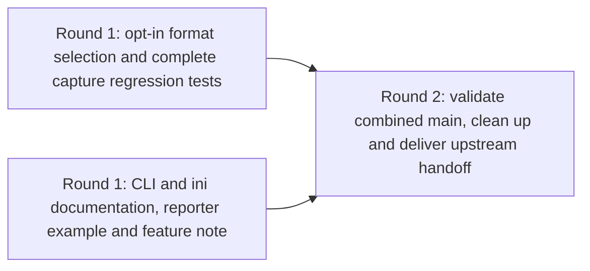

# Full-fidelity Memray captures: fan-out plan

Proposed for human review by [100-102][planning-ticket]. This plan delivers an
explicit full-capture opt-in for allocation-level analysis while preserving
aggregated captures by default. It implements the accepted
[requirements and design][design], merged through [fork PR #2][design-pr].
This planning PR creates no implementation issues or product changes.

| Item | Outcome and owned files                                                                                                                            | Estimated additions / deletions                    | Difficulty |
| ---- | -------------------------------------------------------------------------------------------------------------------------------------------------- | -------------------------------------------------- | ---------- |
| FC-A | Configuration, Tracker selection and regression/reporter tests; plugin.py and two existing test files                                              | 300–550 / 15–45                                    | hard       |
| FC-B | User instructions and feature note; README.md, configuration.rst and one news fragment                                                             | 80–140 / 0–10                                      | easy       |
| FC-C | Combined validation, scoped cleanup and upstream submission/handoff record; one delivery document, with explicitly ordered correction rights below | 100–200 / 0–30, plus only demonstrated corrections | hard       |

Three meaningful nodes, two hard edges, **two minimum dependency rounds**.
Estimates are review-size guidance, not quotas. FC-A's main uncertainty is
testing both file formats with existing marker and interpreter behavior, not
the small format-selection change. No artificial runtime seam is needed.

## Metadata and baseline

- `project_code`: full-captures; `project_color`: orange.
- `repository`: jeremycarroll/pytest-memray; `base_branch`: main.
- `seed_issue`: 100-102; `target_project`: Full-fidelity Memray captures
  (`13af5f34-7e77-4b32-863f-97ded4ea9b16`); Linear team 100
  (`2d7d1d7e-47ff-45d2-8097-19307ad5a589`).
- `human_lead`: Jeremy Carroll, Linear `c65b9fbe-e740-47e9-b444-3172d3526ff2`,
  GitHub `jeremycarroll`. Assign each new issue and fork PR to this lead.
- `linear_issue_labels`: [orange]; `github_pr_labels`: [orange, symphony].
  Difficulty is a field, not an additional label. Do not initially set mature.
- `baseline_context`: main at `09d23352e875d3981117a80ba25632d377187c2c`,
  read 2026-09-12. Design PR #2 merged at this SHA; 100-101 is Done.
  Its historical `status: proposed` front matter does not undo acceptance.
- Reuse [100-103][fanout-ticket] for ticket creation after this plan is accepted.
  The project contains only seeds 100-101, 100-102 and 100-103; no implementation
  or finalizer issue exists to reuse. Do not replace or duplicate these seeds.
- `known_open_decisions`: none. Preserve design R1–R7 and D1–D8. Runtime versions,
  emitted paths, future PR numbers, App/check IDs and signoff permission are
  owned execution inputs, not reasons to defer independent work.

## Decomposition judgment

1. A single implementation/docs/delivery ticket would reduce coordination but
   mix configuration correctness with external submission and make the final
   combined audit less visible.
2. Separate configuration, Tracker, capture tests, docs and delivery tickets
   would repeatedly edit plugin.py and the same pytester module, creating extra
   dependency rounds without independent product outcomes.
3. **Choose implementation/tests and documentation in parallel, then delivery.**
   The accepted design supplies the docs contract now. FC-A and FC-B have
   disjoint file writes, isolated workspaces/test outputs, separate branches and
   PRs, and no shared database, account reset or publish destination. Both read
   upstream sources and existing label definitions without changing them.
   FC-B coordinates merge readiness with FC-A's reporter evidence as soft
   sequencing; it can be authored, built and reviewed without unmerged code.
   FC-C needs both accepted results on main to audit the combined deliverable
   and take over correction rights, so its two incoming edges are hard.

The diagram shows hard dispatch dependencies only. The two rounds count nodes
along the longest hard path; they do not predict worker capacity or elapsed time.

## DAG



The standalone graph is
[fan-out-plan-100-102-full-captures.mmd](./fan-out-plan-100-102-full-captures.mmd).
Neither edge is redundant: FC-C requires the implemented behavior and the
documentation/release-note result independently. FC-C performs delivery work;
it is not a no-op join.

## Execution, source and validation contract

The [execution contract](./full-captures-execution-contract.md) is part of this
reviewed plan. It contains the shared ticket instructions, exact validation
environment and 12 mandatory CI checks, fan-out preflight, source-read ledger
and shared-renderer limitation. Copy its shared execution and validation
sections inline into every generated ticket alongside the manifest node.
All references below to Validation environment mean that document's section.

## Manifest and task content

FC-A, FC-B and FC-C are commissioning keys, **not live Linear identifiers**.
The node fields below are project-specific ticket content in the existing plan
format, not additions to the shared schema. The unchanged shared parser validates
the core graph/manifest contract; the execution contract records rendering limits.

```yaml
schema: symphony-dag-manifest/v1
project:
  code: full-captures
  color: orange
  base_branch: main
  human_lead: Jeremy Carroll
  human_lead_github: jeremycarroll
  linear_issue_labels: [orange]
  github_pr_labels: [orange, symphony]
defaults:
  initial_state: Active
  maturity_label: mature
  task_branch_base: main
  task_pr_base: main
  task_pr_draft: true
  issue_assignee: Jeremy Carroll
  pr_assignee: jeremycarroll
  edge_semantics: hard blockers; upstream accepted and merged to main before FC-C
  relation_type: blocks
  mutation_policy: fail closed; Backlog staging, verified relations, then Active
nodes:
  - id: FC_A
    payload_key: FC-A
    title: Add full capture selection with configuration and reporter regression coverage
    type: task
    difficulty: hard
    labels: [orange]
    branch:
      template: symphony/full-captures/${issue}/full-capture-selection
      base: main
      birth: on_dispatch
    pr:
      create: when_independent_work_publishable
      base: main
      draft: true
      labels: [orange, symphony]
    summary: >-
      Let users choose full allocation captures through --memray-full or
      memray_full while preserving aggregated captures by default. Keep all
      tracking and tracing behavior intact and prove the persisted binaries
      work with the stats reporter, using the existing pytester suite.
    scope: Configuration registration/resolution, existing Tracker argument, AC1-AC6 tests and compatibility/reporter evidence.
    creates: []
    edits:
      - src/pytest_memray/plugin.py
      - tests/test_pytest_memray.py
      - tests/test_object_tracking.py
    owned_files:
      - src/pytest_memray/plugin.py
      - tests/test_pytest_memray.py
      - tests/test_object_tracking.py
    owned_external_resources:
      - FC-A task branch, fork PR and its check/review evidence in jeremycarroll/pytest-memray; no other task PR mutation.
      - FC-A workspace-local virtualenvs, pytester directories, capture files and Docker containers; create/read/delete only these fixtures.
    source_files:
      - docs/symphony-plans/full-captures-requirements-design.md
      - src/pytest_memray/plugin.py
      - src/pytest_memray/utils.py
      - tests/test_pytest_memray.py
      - tests/test_object_tracking.py
      - tests/conftest.py
      - pyproject.toml
      - tox.ini
      - Makefile
      - docker-compose.yml
      - .symphony.cfg.json
    source_notes: Read the project brief, issue 160 and comments, PR 107, release 1.6.0 and official stats docs from the source ledger; shared label definitions are read-only.
    dependencies: []
    integration_pattern:
      pattern: none
    required_actions:
      - Register --memray-full as store_true with absent CLI value None; register Boolean memray_full default false, including CLI help about storage/runtime cost.
      - Before Manager construction, explicitly validate memray_full with pytest's Boolean parser; convert invalid ini to UsageError even with CLI true or inactive tracking. Leave value_or_ini and unrelated option defaults unchanged.
      - Resolve format once per configuration and pass it at the existing tracker_kwargs construction; preserve activation, native/Python tracing overrides, sync/async, persistence and workers.
      - Cover every design configuration-table row in pytest.ini and pyproject.toml where applicable, including -o overrides, repetition, invalid ini and attached CLI values.
      - Extend existing Tracker wrapping assertions to both formats times native on/off times Python allocator tracing on/off; keep all eight combinations and existing default-mode coverage.
      - Extend real persisted-capture tests using fresh directories and subprocess pytest; validate filenames, prefix, parametrized cases, metadata, readability and post-exit survival in both modes.
      - Add a subprocess stats regression using a known allocating fixture; assert positive allocation output for full capture and semantic aggregated-input rejection without matching a whole traceback.
      - Exercise full mode with no activation, marker-only activation, summary/limit_memory, limit_leaks overrides, async, xdist propagation and object tracking on supported Python; retain retry/conflict/cleanup/long-name/overwrite coverage.
      - Verify minimum Memray 1.19.1 on a compatible interpreter and normal supported CI; record version resolution and exact reporter/capture commands and paths in PR/workpad evidence.
    acceptance_checks:
      - Design AC1 and AC2 configuration/invalid-input cases pass; invalid ini creates no Manager result directories or Tracker.
      - Design AC3 eight argument combinations and independent activation rules pass without changing unrelated settings.
      - Design AC4 binaries in both modes are real, closed, readable and retained with expected per-test metadata and names.
      - Design AC5 full-mode stats succeeds with positive allocations; aggregated stats rejects the same-version fixture as non-full input; exact commands, versions and SHA are recorded.
      - Design AC6 full-mode integration paths and existing regression suite pass, including applicable object tracking and all mandatory current-head checks.
      - Dependency bounds remain unchanged; any unresolved compatibility result is visible and prevents a false compatibility claim.
    validation_commands:
      - "python -m pytest -q tests/test_pytest_memray.py tests/test_object_tracking.py"
      - "make check"
      - "make lint"
      - "python -c 'import sys, pytest, memray; print(sys.version); print(pytest.__version__); print(memray.__version__)'"
      - "python -m pytest --memray --memray-full --memray-bin-path CAPTURE_DIR TEST_FILE"
      - "python -m memray stats CAPTURE.bin"
      - "Repeat the capture without --memray-full in a fresh directory; stats must reject the aggregated binary. Resolve fixture paths from actual emitted files."
      - "Run AC1-AC6 with memray==1.19.1 in an isolated compatible environment; retain version output and applicable interpreter limitations."
      - "Then Docker only for unavailable required local checks, using Validation environment; otherwise record Docker: skipped — passed locally."
      - "Then mandatory published-head Run and Build checks: all 12 named in Validation environment."
    delivery_notes:
      - Estimate 300-550 additions and 15-45 deletions; keep implementation and meaningful regression tests in one PR.
      - E1/E2 owner; E3/E5 for this PR. Give FC-B the exact successful reporter command/version without editing its files.
      - FC-C takes correction ownership only after this result is accepted and merged to main; do not overlap later rework without coordinating the plan.
    split_criteria:
      [domain-boundary, shared-orchestrator-file, validation-surface]
    exclusions:
      - README.md, docs/configuration.rst and news edits belong to FC-B.
      - No environment variable, negative flag, enum, alias, new capture pipeline or shared configuration-helper repair.
      - No changes to markers, output, file naming/cleanup, dependency floors, CI workflows or release/deploy operations.

  - id: FC_B
    payload_key: FC-B
    title: Document full capture configuration and downstream reporter use
    type: task
    difficulty: easy
    labels: [orange]
    branch:
      template: symphony/full-captures/${issue}/full-capture-docs
      base: main
      birth: on_dispatch
    pr:
      create: when_independent_work_publishable
      base: main
      draft: true
      labels: [orange, symphony]
    summary: >-
      Explain how users opt into full captures for allocation-level reporting,
      retain capture files and return to the aggregated default. Document the
      accepted CLI/ini contract and cost without implying that full mode enables
      tracking or isolates a subsection of a test.
    scope: README and configuration guide updates plus a towncrier feature fragment; AC7.
    creates:
      - docs/news/160.feature.rst
    edits:
      - README.md
      - docs/configuration.rst
    owned_files:
      - README.md
      - docs/configuration.rst
      - docs/news/160.feature.rst
    owned_external_resources:
      - FC-B task branch, fork PR and its check/review evidence in jeremycarroll/pytest-memray; no other task PR mutation.
      - FC-B workspace-local docs output, virtualenv and Docker containers; no hosted documentation publication or shared capture directory.
    source_files:
      - docs/symphony-plans/full-captures-requirements-design.md
      - README.md
      - docs/configuration.rst
      - docs/news/template.jinja2
      - pyproject.toml
      - Makefile
      - tox.ini
      - docker-compose.yml
      - .symphony.cfg.json
    source_notes: Read issue 160 and comments, PR 107, release 1.6.0 and official reporter docs; use FC-A evidence when available, with the accepted design as the initial interface source.
    dependencies:
      - item: FC-A
        type: sequencing
        requires: Inspect FC-A's successful stats command/version before final documentation merge readiness.
        reason: Drafting, docs builds and review are independent; executing the new CLI example requires FC-A, and FC-C rechecks it on combined main.
    integration_pattern:
      pattern: none
    required_actions:
      - Document --memray-full and Boolean memray_full in both option references; default false/aggregated, CLI-over-ini and -o memray_full=false without the CLI flag.
      - Include pytest.ini and pyproject.toml examples, explicit --memray activation and --memray-bin-path persistence, including the native and Python allocator options from issue 160.
      - Explain invalid Boolean/attached-value errors, harmless repeated flags, independent tracking activation and unchanged temporary-file lifetime.
      - Give the stats workflow from the design and exact observed version from FC-A when available; discover the emitted .bin rather than select metadata. Clearly distinguish planned examples from executed evidence until verified.
      - Explain increased file size and potential runtime overhead without numbers; full format changes neither allocator coverage nor whole-test tracking boundaries, and manual Tracker remains appropriate for subtest isolation.
      - Add docs/news/160.feature.rst referencing the actual upstream issue, with no invented PR number; FC-C renames to the real upstream PR number when available.
    acceptance_checks:
      - Design AC7 is covered in README/configuration docs; both settings, precedence/disable override, persistence, cost and manual-Tracker boundary are clear.
      - Examples agree with the accepted design and FC-A's observed reporter interface before merge readiness; no unrun example is described as verified.
      - Markdown formatting, Sphinx docs and all 12 current-head required checks pass, even though only documentation changes.
      - Feature fragment exists and uses actual issue 160 as the provisional number; the final PR-number handoff to FC-C is explicit.
    validation_commands:
      - "prettier --no-editorconfig --check README.md"
      - "make docs"
      - "python -m towncrier build --draft --version 0.0.0"
      - "Compare both examples against the design table and FC-A's exact successful stats evidence before merge readiness; no runtime success claim while FC-A is unavailable."
      - "Then Docker only for unavailable required local checks, using Validation environment; otherwise record Docker: skipped — passed locally."
      - "Then mandatory published-head Run and Build checks: all 12 named in Validation environment."
    delivery_notes:
      - Estimate 80-140 additions and 0-10 deletions; no production code or test writes.
      - Own E3/E5 for this PR and provisional E4 fragment naming; FC-C owns the actual upstream PR-number substitution.
      - Shared upstream sources/labels are read-only; use separate docs output and a separate PR. Soft FC-A sequencing creates no extra Linear relation.
      - FC-C receives README/configuration/news correction rights only after FC-B is accepted and merged to main.
    split_criteria: [target-user-workflow, low-risk-batch]
    exclusions:
      - No plugin or test changes, generated release changelog, package publication or hosted docs deployment.
      - No performance claims, new reporters, CSV workflows, unrelated doc cleanups or fake upstream PR number.

  - id: FC_C
    payload_key: FC-C
    title: Validate the combined change and finalize upstream submission or handoff
    type: finalize
    difficulty: hard
    labels: [orange]
    branch:
      template: symphony/full-captures/${issue}/finalize-full-captures
      base: main
      birth: on_dispatch
    pr:
      create: when_independent_work_publishable
      base: main
      draft: true
      labels: [orange, symphony]
    summary: >-
      Validate the accepted implementation and documentation together on main,
      close project-scoped cleanup, and prepare the upstream-ready contribution.
      Record either the actual upstream submission or a complete Jeremy-owned
      submission handoff, including signoff and permission requirements, without
      claiming an upstream merge, release or issue closure.
    scope: Combined AC1-AC8 audit, limited discovered corrections, delivery evidence and upstream handoff; E4/E6 ownership.
    creates:
      - docs/symphony-plans/full-captures-delivery.md
    edits:
      - src/pytest_memray/plugin.py
      - tests/test_pytest_memray.py
      - tests/test_object_tracking.py
      - README.md
      - docs/configuration.rst
      - docs/news/160.feature.rst
    owned_files:
      - docs/symphony-plans/full-captures-delivery.md
      - src/pytest_memray/plugin.py
      - tests/test_pytest_memray.py
      - tests/test_object_tracking.py
      - README.md
      - docs/configuration.rst
      - docs/news/160.feature.rst
    owned_external_resources:
      - FC-C task branch/fork PR and its evidence in jeremycarroll/pytest-memray; read prior accepted PRs, do not modify active predecessor work.
      - FC-C workspace-local combined validation captures, environments, build outputs and task containers; cleanup only these resources.
      - One project-specific upstream submission to bloomberg/pytest-memray referencing issue 160, only through verified authorized submission/signoff; otherwise Jeremy owns that operation.
    source_files:
      - docs/symphony-plans/full-captures-requirements-design.md
      - docs/symphony-plans/fan-out-plan-100-102-full-captures.md
      - src/pytest_memray/plugin.py
      - tests/test_pytest_memray.py
      - tests/test_object_tracking.py
      - README.md
      - docs/configuration.rst
      - docs/news/160.feature.rst
      - .symphony.cfg.json
      - pyproject.toml
      - tox.ini
      - Makefile
      - docker-compose.yml
    source_notes: Inspect accepted FC-A/FC-B PRs and full workpad/check/review evidence, the upstream issue and current upstream contribution/DCO instructions; do not infer current authority from fork access.
    dependencies:
      - item: FC-A
        type: hard
        requires: FC-A accepted, Done and merged into main with passing checks and closed mandatory feedback.
        reason: Combined runtime acceptance and transfer of plugin/test correction ownership require the actual implemented result.
      - item: FC-B
        type: hard
        requires: FC-B accepted, Done and merged into main with passing checks and closed mandatory feedback.
        reason: Combined user workflow and transfer of documentation/news correction ownership require the actual documentation result.
    integration_pattern:
      pattern: none
    finalization_responsibility:
      - Audit project diff for TODO, FIXME, stub, adapter, disabled-path, compatibility-export and temporary-flag remnants; no temporary integration seam is planned. Record each disposition and preserve unrelated pre-existing markers.
      - Remove or fix only project-introduced remnants within owned files after both predecessors land; amend the plan before expanding scope. Do not perform broad cleanup or delete open branches.
      - Rename the provisional news fragment to docs/news/<actual-upstream-PR-number>.feature.rst only after observing that PR. Record the exact resolved source/destination ownership before editing; no glob authority over other fragments.
      - Record no deployment/package release requirement, actual installed/tested refs, combined evidence, submission or precise human handoff and any observed maintainer decision.
    required_actions:
      - Fetch main and verify both accepted task merge results are present; record starting main SHA, both PRs/commits, final tested SHA, conflicts and scoped cleanup commits or none.
      - Run combined regression and docs checks, repeat the documented full capture/stats workflow on a known allocating fixture, and verify aggregated default on the same installed version.
      - Close the AC1-AC8 and E1-E6 ledger using exact evidence; inspect minimum-version coverage and supported object-tracking CI, rerunning only gaps or changed behavior.
      - Use symphony-finalize-project for the scoped cleanup/evidence audit; fix demonstrated in-scope regressions, with targeted reruns and mandatory CI on any new head.
      - Publish the delivery record in a clean main-based fork PR; do not include already merged predecessor commits in its diff. Preserve the actual tested code/installed package provenance separately from documentation-only later commits.
      - Prepare the upstream submission from the accepted product-only diff of FC-A/FC-B and any FC-C corrections; list exact files/commits and exclude Symphony onboarding/planning files or unrelated fork divergence. Never submit the fork main branch wholesale.
      - Verify submission permission and the contribution author's real DCO signoff; never fabricate signoff for Jeremy. Submit only when these are satisfied, otherwise deliver exact patch/commit source, target, title/body, checks and Jeremy actions in the pinned workpad and delivery record.
      - Record upstream PR URL and actual number when submitted; update the fragment number as an explicitly scoped follow-up with current-head checks, or identify the exact rename instruction in the human handoff if no PR exists yet.
      - Record any actual maintainer decision, remaining limitations and ownership. Hand project acceptance to Jeremy; never close issue 160, merge upstream, publish a package or claim completion from source availability.
    acceptance_checks:
      - Both accepted task results are present on the recorded main ref; combined regression/docs/reporter behavior meets AC1-AC7 with versions and exact output evidence.
      - Every project-scoped temporary marker is removed or explicitly accepted as durable; unrelated pre-existing code/markers remain untouched and no task containers persist.
      - All 12 current-head required checks and fresh configured Cadence approval pass for the final fork PR; mandatory feedback is closed, branch clean, PR ready and labels/assignee verified.
      - AC8 includes FC-A/FC-B/final fork PR links and either an actual upstream submission or a concrete Jeremy-owned submission package with exact base/diff, DCO/permission action and readback.
      - News filename uses the observed upstream PR number if available; otherwise the delivery handoff gives the exact required rename, without inventing an identifier.
      - Delivery document accounts for AC1-AC8, E1-E6, cleanup and no-deployment scope; no unsupported upstream acceptance, release or Done claim.
    validation_commands:
      - "make check"
      - "make lint"
      - "make docs"
      - "pipx run build[virtualenv] --sdist --wheel"
      - "prettier --no-editorconfig --check docs/symphony-plans/full-captures-delivery.md README.md"
      - "python -m towncrier build --draft --version 0.0.0"
      - "python -c 'import sys, pytest, memray; print(sys.version); print(pytest.__version__); print(memray.__version__)'"
      - "python -m pytest --memray --memray-full --native --trace-python-allocators --memray-bin-path CAPTURE_DIR TEST_FILE"
      - "python -m memray stats CAPTURE.bin"
      - "Repeat without --memray-full in a fresh directory and verify aggregated reporter rejection; record actual fixture paths, output, installed revision and versions."
      - "git diff --check"
      - "rg -n 'TODO|FIXME|stub|adapter|disabled|compat' src/pytest_memray/plugin.py tests/test_pytest_memray.py tests/test_object_tracking.py README.md docs/configuration.rst docs/news/160.feature.rst"
      - "Then Docker only for unavailable required local checks, using Validation environment; otherwise record Docker: skipped — passed locally."
      - "Then mandatory published-head Run and Build checks: all 12 named in Validation environment, plus upstream's observed requirements if a submission is made."
    delivery_notes:
      - Estimate 100-200 additions and 0-30 deletions for the record; correction scope is bounded by demonstrated project defects, not an assumed cleanup budget.
      - Own final E1/E2/E3 evidence closure, E4 actual identifiers/fragment name and E6 submission/signoff. Jeremy supplies E5 access only if needed.
      - Correction ownership is sequential after both accepted merges, never parallel with FC-A/FC-B. Resolve the one news destination from the actual PR response and record it before mutation.
      - Upstream submission is a distinct external handoff, not a task-branch base exception. The fork task PR always targets main; avoid unauthorized upstream writes and retain a reviewable product-only patch when access is absent.
    split_criteria:
      [
        fan-out-finalization-boundary,
        external-system-boundary,
        proof-of-work-boundary,
      ]
    exclusions:
      - No release/tag/PyPI or hosted deployment, upstream merge or issue closure, broad refactor, shared planning/review process edits or fabricated DCO signoff.
      - No unrelated fork changes in the upstream contribution and no deletion of other workers' resources or historical planning evidence.
edges:
  - from: FC_A
    to: FC_C
  - from: FC_B
    to: FC_C
```

## Branch manifest

`${issue}` is replaced only with the actual created Linear identifier. All
branches are born on dispatch from current main, all task PRs target main,
and all start draft. The readiness contract above governs ready status.

| Node | Branch template                                          | Branch base | PR base | PR policy                                  |
| ---- | -------------------------------------------------------- | ----------- | ------- | ------------------------------------------ |
| FC_A | `symphony/full-captures/${issue}/full-capture-selection` | main        | main    | Draft when independent work is publishable |
| FC_B | `symphony/full-captures/${issue}/full-capture-docs`      | main        | main    | Draft when independent work is publishable |
| FC_C | `symphony/full-captures/${issue}/finalize-full-captures` | main        | main    | Draft when independent work is publishable |

## Linear Relation Payloads

These are the complete hard-edge instructions. They are symbolic inspection
payloads until 100-103 replaces each key with the **observed** issue UUID.

| Source       | issueId | relatedIssueId | type   |
| ------------ | ------- | -------------- | ------ |
| FC_A to FC_C | FC-A    | FC-C           | blocks |
| FC_B to FC_C | FC-B    | FC-C           | blocks |

```json
[
  { "issueId": "FC-A", "relatedIssueId": "FC-C", "type": "blocks" },
  { "issueId": "FC-B", "relatedIssueId": "FC-C", "type": "blocks" }
]
```

`issueId` is always the blocker and `relatedIssueId` the blocked issue. FC-C
has two direct incoming blockers. No FC-A → FC-B relation is authorized.
Preserve existing seed relations 100-101 → 100-102 → 100-103; these are outside
the generated implementation graph and are not recreated by this table.

## Decisions

1. **Preserve the accepted public contract.** D1–D4/D7 require the two positive
   opt-in surfaces, explicit aggregated default, eager invalid-ini rejection,
   unchanged activation/tracing and one existing Tracker path. FC-A enforces
   behavior and CLI help; FC-B documents it. No extra product decision is open.
2. **Keep implementation and meaningful tests together.** FC-A owns the shared
   plugin/test surfaces; splitting them adds overlapping writes and hard rounds
   for a small feature. Its PR includes minimum-version and real reporter proof.
3. **Allow independent documentation preparation.** The accepted design is the
   interface source, FC-B owns disjoint files, and runtime example confirmation
   is explicit soft sequencing with FC-A. FC-C audits their combined result.
4. **Use direct fan-in and clean main-based task branches.** Both accepted results
   independently block FC-C; graph, manifest and relation table contain exactly
   those edges. The branch manifest enforces main for base and PR target, with
   no predecessor work committed before it lands there.
5. **Verify stats and compatibility without expanding scope.** Design D5/D6 and
   E1/E2 assign minimum Memray 1.19.1 and real stats proof to FC-A, checked again
   by FC-C. Temporal HTML is optional; no dependency bump or benchmark project
   is presumed. Record actual failures before amending the design.
6. **Stage relations before activation.** 100-103 creates exactly three task
   issues in Backlog, verifies IDs and both directions, then moves all to Active.
   Unfinished predecessors gate dispatch. No human hold was requested.
7. **Gate human handoff on current evidence.** Every node owns local/Docker/CI
   proof and fresh configured Cadence approval, feedback closure, clean branch
   and ready PR. Blocker-side mature follows the shared contract above, not an
   earlier approved SHA or source-only evidence.
8. **Finalize a product-only upstream handoff.** FC-C owns the delivery record,
   bounded corrections, news-number substitution and exact DCO/permission
   handoff to Jeremy. Accepted design D8/R7 permits submission or handoff;
   deployment, release, upstream merge and issue closure are excluded.

[project]: https://linear.app/1000lines/project/full-fidelity-memray-captures-b6e86c398fab
[planning-ticket]: https://linear.app/1000lines/issue/100-102
[fanout-ticket]: https://linear.app/1000lines/issue/100-103
[design]: ./full-captures-requirements-design.md
[design-pr]: https://github.com/jeremycarroll/pytest-memray/pull/2
